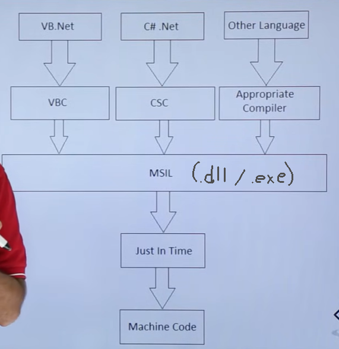

# Process of .NET framework
Compilation Process được chia thành 2 phần:
- P1: Language được compile bởi compiler tương ứng -> MSIL (Microsoft Intermediate Language)
  - C#.Net compile bởi CSC (CSharp compiler), VB.Net compile bởi VBC
  - (MSIL): 
    - Nếu source code chứa hàm **main()** -> được compile thành .exe
    - Nếu source code không chứa main() -> được compile thành .dll
    - .exe và .dll được gọi là PE (portable execution)
- P2: Thực hiện bởi **Common Language Runtime** - **JIT compiler **
  - Compile IR (Intermediate Language) thành native machine code (bản chất là các file nhị phân)



Mở CMD và vào thư mục chứa file code
```
set path="C:\Windows\Microsoft.NET\Framework\v4.0.30319"
```

- Compile source code .cs
```
csc main.cs
```

- Chạy thử
```
main.exe
```

- Compile source code .vb
```
vbc /out:new_main.exe main.vb
```

- Chạy thử
```
new_main.exe
```

# References
<a href = "https://www.youtube.com/watch?v=6oYcZ-D8Fyw">NET Framework - Compilation Process</a> - Youtube